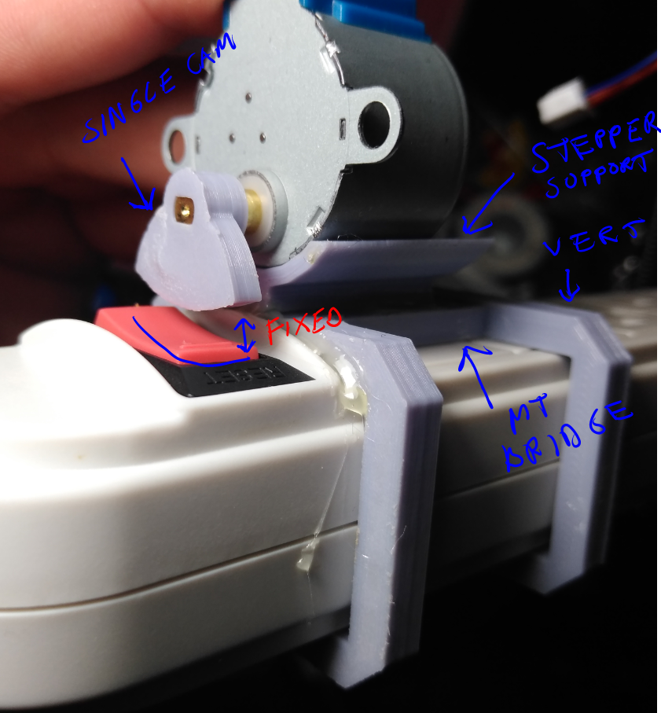

### Note

These files are for the parts I printed to attach a stepper to this particular power strip I had with the red reset switch. This is up to you if you want to use this.

I used Google SketchUp Make(brutally slow to use on Windows 10, i7, 4Gb graphics card, 32GB ram) and Cura to slice these files. Ender Pro 3 to print the models.

### Annotation

Some rough idea of the parts

