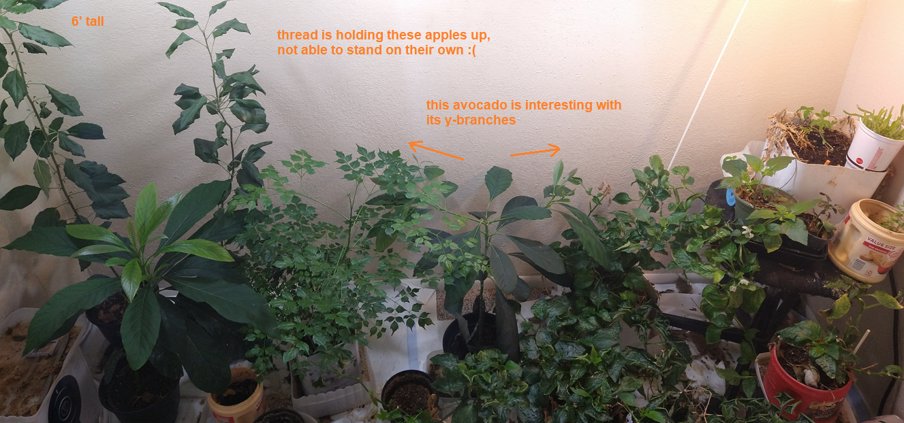
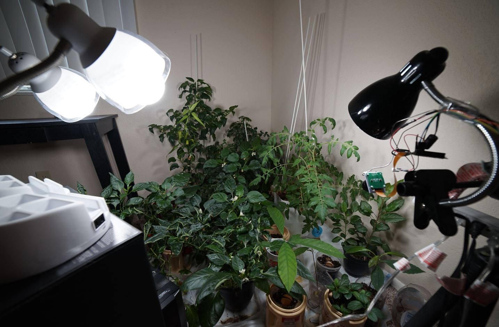

### IoT coffee container

Ehh... I guess the name might seem misleading. I originally was going to mount the electronics to the coffee container but I grossly underestimated how heavy/bulky everything was going to be.

#### About
This is a quick side project, a stepper turns on a power strip that powers a growth light.
I also strapped a camera onto the light so I can schedule screenshots to eventually compose a time lapse of hopefully something growing.

#### Purpose

Only purpose is to schedule the growth light(wall timer) and take screenshtos for a timelapse. Also will have a web interface to show/filter the images by date.

#### Requirements
##### Hardware
- Pi, pi cam, stepper/servo, power strip with switch, growth lamp, 3d printer
##### Software
- Python, Apache, Node/NPM

#### Installation

Everything is hosted on the Pi, it uses Apache for the web server and the photos are not indexed/paths are not stored anywhere. There is a known folder pattern and the front end checks if the particular images exist. This is just laziness but arguable not really necessary since I control the file names/where the images are saved.

Yeah this is not going to be a "runs out of the box" setup, requires some developer knowledge, sorry about that, it's just a side quick project I didn't want to drop too much time on.

I will include a compiled front end that can be used as is, but requires matchin the folder structure for photos(as defined in current code)

Will update with bare minimum setup.

#### Installation steps

- install Apache `$sudo apt install apache2`
- move content from `docs` folder into the public Apache folder `/var/www/html`
  - can access web interface at your Raspberry Pi's local `192` ip. eg. `192.1.#.#/plant-photos`
- add CRON paths using crontab `$crontab -e`
- add these CRON commands with log output
  - `30 8 * * * /usr/bin/python /home/pi/iot-coffee-container-plant/motion/lamp_on.py > /home/pi/logs/iot_coffee_plant_on.log 2>&1` - 8:30 AM
  - `0 20 * * * /usr/bin/python /home/pi/iot-coffee-container-plant/motion/lamp_off.py > /home/pi/logs/iot_coffee_plant_off.log 2>&1` - 8:00 PM
- `$sudo crontab -e` for photo, mostly for changing folder permission for web
  - specifically allows creating the `/plant-photos/` folder in `/var/www/html` that's owned by root to store images
  - read the code if you have doubts of what it does
  - `0 12 * * * /usr/bin/python /home/pi/iot-coffee-container-plant/take-photo/daily_photo.py > /home/pi/logs/iot_coffee_plant_take_photo.log 2>&1`

Also I did do a pretty good amount of error checking eg. in case folders fail to be created.

#### Progress

##### 07-01-2023

At this point I have moved the garden, added another light.

I currently have:

- apples
- avocados
- china doll
- bell peppers (most of bottom right)
- dragon fruit (bk cup)
- pomegranate (below bk cup in coffee creamer)
- tomatoes

whoa this date update is purely coincidence I will say

Photo is from 06-12-2023

##### 07-01-2022

So this definitely expanded... the functionality has remained the same. Main change is the type of bulb. I am using these `ultra light LED` bubs `LED A21` 3010 lumens.

I'm growing: bell peppers (mostly), beef tomatoes, avocadoes, dragon fruit, mangoes and apples.

The daily photos has allowed me to generate time lapses such as this:

https://user-images.githubusercontent.com/11015467/176962284-e78d4e6d-e8e0-45c0-bf53-d16b51ea35c5.mp4

##### 07-23-2020

###### Working setup (video)

###### Working mechanics (video)

